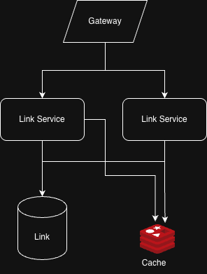
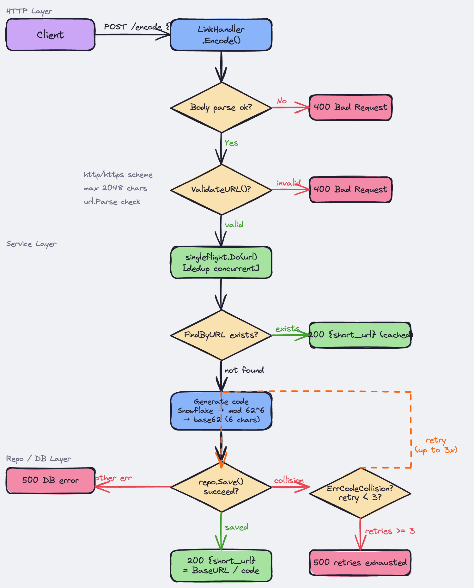
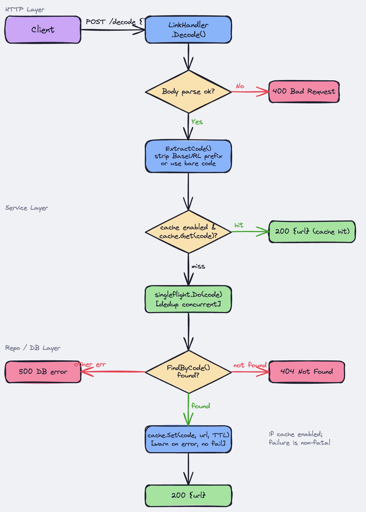

# STEPS TO THE MOON

When I read this requirement, the first thing I always do is to clarify the business workflow.

# Clarity

- How many characters is the short url? 6 chars
- What is the maximum of the URL? assume ~2048 chars
- What is the latency we need to expect for read? assume p95 < 200ms
- Do we need authentication for url? no require for MVP
- What is the ratio of read to write? expect 50 : 1
- How many urls do we expect to create per day? 100000 requests / day

There are some scopes I think we need to cover first to design architecture.

# Back-of-the-envolope and Key Decision

Based on the scopes, I must calculate the volume for both side read and write.
We need to cover the number of storage and throughput surrounding requests and data.

I assume that 100000 reqs/day (86400) =~ 2 write/s, and x2 at peak ~= 4 write/s.

Then, the ratio of read to write is 50 : 1,
so the read requests per second is 100 QPS, and approximately 200 QPS.

After that, I come to the storage of url. the volume of the url at 1KB each is 100MB per day, and we look at about ~36GB. that's fine.

Based on the analysis, I realize some cases we need to handle.

- Firstly, the write per second is 2, it can cause the collison if we handle carelessly. Beside, write operation must be strong consistent.
- Secondly, for read side, to ensure the requirement under 200 ms, eventual consistency is acceptable. the data is staleness. But we need careful handling thundering herd with calling one endpoint so many times, that's called hot spot.
- Finally, to adapt scalable service for future, we must design ID generator that fit with multiple nodes running in parallel.

## Key Decision

### ID Generator

There are some ways to implement ID generator. I will tell a bit pros and cons of these ways:

- **Increment ID**: it's easiest way to implement ID generator. But, it's too easy to guess and take over from our system.
- **Hash URL**: it's a bit harder and must use some algorithm to implement, for example, CRC32 (too short), SHA258 (too long) we have to cut only 6 chars from hashed string. it's almost occurred the collision.
- **Random 6 chars**: generate random 6 chars from base62, it's great to implement that. but sometimes, it causes collision because it's random and we can't control it.
- **UUIDv7**: actually, I think of UUIDv4 first, I realized that it takes long bit to represent 128bit(16 bytes) and random chars. and I found out that the next generation of UUID is UUIDv7, it includes timestamp and random the rest of bits. If the system is required long ID for distributed system, this is best way to use.
- **SnowflakeID**: this is greatest way to avoid collision from generating ID simultaniously. And, it only takes 64bit as representing full ID
  - 1 bit: sign (0) - 41 bits: timestamp - 5 bits: data center - 5 bits: node ID - 12 bits: sequence
  - Despite, it can avoid collision in scaling up system, we must handle issues around this solution. it consists of clock skew, coordination.
- **Centralized allocation by block**: It's like a centralized ID generator distributes a bunch of IDs to each node, and mark them as used. but it's hard to get back ids if the node disrupted or is outage immediately.

So my last decision for ID generator is SnowflakeID. because it avoids collision in parellel process is the best, and we can convert SnowflakeID into base62 simply.
I mitigate the issues:

- the clock skew by saving last_timestamp and compare it with current timestamp; if less a bit ms than, wait until current_time catch up with last_timestamp, and generate; if less some seconds, throw error;
- the coordination by using HPA or auto scaling in K8s, it have node-{number_id}. I can take advange of the number to mark the number of coordinator when generating id.

In my demo, I only use one node to implement snowflakeID.

### High throughput & Availability

To ensure High throughput & Availability, that is latency under 200ms, we must use cache to reduce request reaching the database. That is the important thing to implement in this system.
Because if the system is under pressure calling URL via API, database might take down and cause the entire system's pending.
We must cover this part as neccessary thing for our system.

# Architecture



Architecture is simple.

The main components:

- Gateway as reserve proxy running logging, rate limiter, auth if applicable.
- Link service written by Golang to take advance of lightweight concurency and handling massive requests.
- Postgresql is the source of truth and fit with requests.
- Redis cache is to adopt requirement under 200ms.

# Data Model

```
Table Link:
- code          : it's for short url (6 chars, unique)
- long_url      : it's for original url
- created_at    : it's creation date
```

The most important thing in this model is how to handle collision if it happens.

As we can see, everything is not perfect, sometimes code and long_url can duplicate from client or ID generator.
The thing we must do is to avoid the issue a code belongs to two long_url or long_url has two code.

There are some ways to help us avoid it:

- **Permistic Lock**: the system use query like `SELECT 1 from links where code = $1 FOR UPDATE`. that locks record at row-level (prevent other transaction both read/write) and then we return if exists.
- **Idempotency Lock**: table flag code as unique and execute `INSERT INTO links (code, long_url) VALUES ($1, $2)` to violate unique constraint.

After looking around both solutions, I decide to choose **Idempotency Lock** to handle collision.
Because there are two reasons for that.

- Firstly, unique index helps us find faster and avoid multi-created transaction into the same code.
- Secondly, using two command to query and insert code takes two network hops and causes increasing latency for query, while one command insert only take one network hop and push the responsibility to database engine, that's faster and more durable.

# APIs

As requirements, we have two endpoints:

- /encode : Encodes a URL to a shortend URL

```
POST /encode
Body:
{
    "url": "https://codesubmit.io/library/react"
}

Response 201 Created:
{
    "short_url": "http://domain.name/GeAi9K"
}

Errors:
  400 — invalid URL format
  409 — custom alias already taken
```



- /decode: Decodes a shortened URL to its original URL

```
POST /decode
Body:
{
    "short_url": "http://domain.name/GeAi9K" | "GeAi9K"
}

Response 200 Created:
{
    "url": "https://codesubmit.io/library/react"
}

Errors:
  400 — bad request
  404 — short code not found
```



Moreover, I add more endpoint with propose of redirecting to orignal URL from our endpoint

```
GET /{code}

Response 302 Temporary Redirect
  Location: https://example.com/very/long/path

Errors:
  404 - not found
```

At this endpoint, I concern about two status code

- 301: Moved Permanently. The original URL will store in browser and never reach our system again. Good for latency and cost, Bad if we need to update the original url or track clicks.
- 302: Temporary Redirect. Every request hit our system. Bad for load, Good for tracking clicks and redirecting.

So I choose Status 302 for analytics and flexibility.

# Deep Dive & Trade-off

Actually, after testing `/decode` endpoints, I realize that it drop into database very much.
This is where I must do cache layer as cache-aside to reduce requests reaching database in the same time.

But in this place, new issues come up. We must cover some aspects between cost and data.

- Because the short url is rarely changed, and it will be saved in cache a long time.
- The volume of Cache is limited, we can't store all short urls on this cache.

So I come up with a balance between them, that is implementing

1. TTL (Time To Live)
2. LRU (Least Recently Used) Cache.

With 2 solutions, the system can endure under pressure and avoid the many requests on the same code / url, that's called `hot-spot`.

## Thundering-Herd Problem

At the same time testing, I found out that when I try to call massive requests at `/decode`, almost requests are still drop down to database even it has a cache layer in the middle.

So the solution right here is **single fly request**. I use `singleflight` package to group all requests that are the same requests to our system, only one processes and all the rests return the same result.

And I do the same thing with `/encode` for endurable.

# Conclusion

Let me take notes some key concepts in my design and say some points need to be improving in this architecture:

## KEY CONCEPTS

- **Code Generator**: SnowflakeID fits for scaling up service based on the number of node and is the best to avoid collision in parallel running. it's hard to predict from client.
- **Collision**: there is two sides we need to consider `Code` and `Original URL`. Postgres is the best choice for preventing the collision at database level, it allows to run multi-processes at same time and block mistakes from human code in deduplication.
- **Scalability**: At scaling scenarios, the system must solve thundering herd problem and ensure that the endpoint adopt under 200ms requirement with `singleflight` package and `cache layer` .

## IMPROVEMENT

- **Rate Limiter**: On production, we need to protect our system when hacker attacks. We must implment rate limiter as middleware to control the requests and throughput in the system.
- **Vulneralbility**: There are always exists the vulneralbility all the time, we need to scan dependencies period to avoid the unexpected issues.
- **Node Number**: at this time, I only hardcode node 1 for snowflakeID generator. on production, we need a mechanism to get that number and use for scale.
- **Authentication**: If needed, we will need authentication to keep original url belonging to owner.
